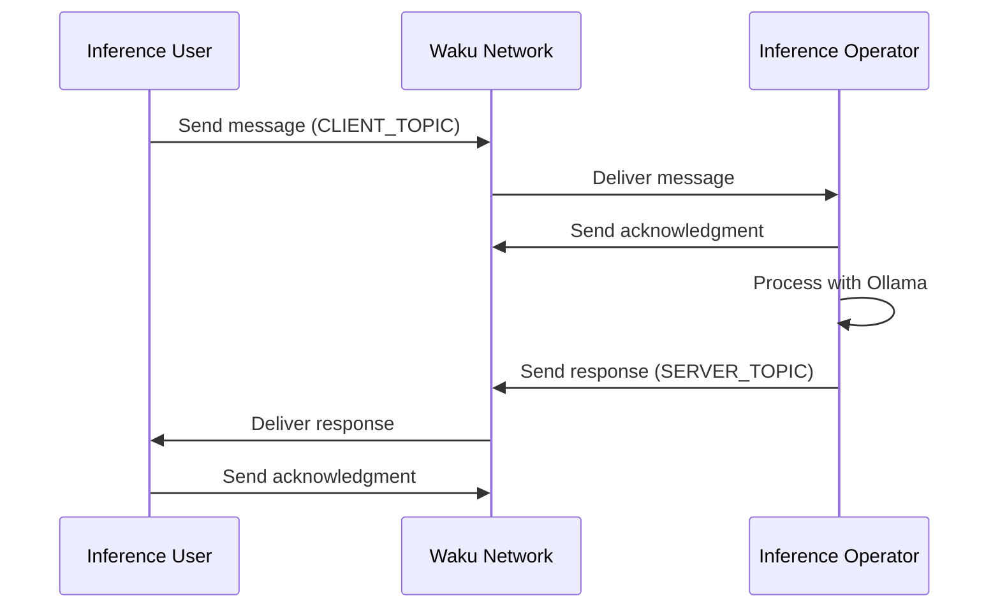

# Waku Integration Instructions

This document explains how to integrate Waku-based communication in your application for both inference users and operators.

## Overview

The system consists of two modes:
1. **Inference User Mode**: End users who want to chat and get AI responses
2. **Inference Operator Mode**: Operators who run the AI model (Ollama) and process requests

## Communication Flow



## Constants

```javascript
const CLIENT_TOPIC = '/waku-chat/1/client-message/proto';
const SERVER_TOPIC = '/waku-chat/1/server-response/proto';
const RETRY_DELAY = 2000; // 2 seconds
const MAX_RETRIES = 3;
```

## Message Format

Messages are formatted as JSON strings with the following structure:

```javascript
{
  id: string,           // Unique message ID
  type: string,         // 'message' or 'ack'
  content: string,      // Message content (null for acks)
  timestamp: number,    // Unix timestamp
  originalMessageId?: string  // Only for ack messages
}
```

## Required Functions

### Common Functions

```javascript
// Generate unique message ID
const generateMessageId = () => {
  return `${Date.now()}-${Math.random().toString(36).substr(2, 9)}`;
};

// Format message for sending
const formatMessage = (content, type = 'message', originalMessageId = null) => {
  return JSON.stringify({
    id: generateMessageId(),
    type,
    content,
    timestamp: Date.now(),
    originalMessageId
  });
};

// Send message with retry mechanism
const sendMessageWithRetry = async (node, encoder, message, retries = MAX_RETRIES) => {
  const messageId = JSON.parse(message).id;
  setPendingMessages(prev => new Set(prev).add(messageId));

  for (let i = 0; i < retries; i++) {
    try {
      await node.lightPush.send(encoder, {
        payload: new TextEncoder().encode(message)
      });
      console.log("Message sent successfully:", message);
      return true;
    } catch (error) {
      console.error(`Send attempt ${i + 1} failed:`, error);
      if (i < retries - 1) {
        console.log(`Retrying in ${RETRY_DELAY}ms...`);
        await new Promise(resolve => setTimeout(resolve, RETRY_DELAY));
      }
    }
  }
  setPendingMessages(prev => {
    const newSet = new Set(prev);
    newSet.delete(messageId);
    return newSet;
  });
  return false;
};
```

## Inference User Mode Implementation

### Required State
```javascript
const [waku, setWaku] = useState(null);
const [messages, setMessages] = useState([]);
const [status, setStatus] = useState("disconnected");
const [pendingMessages, setPendingMessages] = useState(new Set());
const [isWaiting, setIsWaiting] = useState(false);
```

### Setup Waku Connection
```javascript
async function setupWaku() {
  try {
    setStatus("connecting");
    const node = await createLightNode({ defaultBootstrap: true });
    await node.start();
    
    await Promise.all([
      waitForRemotePeer(node, [Protocols.LightPush]),
      waitForRemotePeer(node, [Protocols.Filter])
    ]);

    if (!node.filter || !node.lightPush) {
      throw new Error("Required protocols not available");
    }

    const encoder = createEncoder({ contentTopic: CLIENT_TOPIC });
    const decoder = createDecoder(SERVER_TOPIC);

    // Set up message handler
    await node.filter.subscribe([decoder], handleIncomingMessage);
    
    setWaku({ node, encoder });
    setStatus("connected");
  } catch (error) {
    console.error("Waku setup failed:", error);
    setStatus("error");
  }
}
```

### Handle Messages
```javascript
const handleIncomingMessage = (wakuMessage) => {
  if (!wakuMessage.payload) return;
  
  try {
    const messageStr = new TextDecoder().decode(wakuMessage.payload);
    const message = JSON.parse(messageStr);

    if (message.type === 'ack') {
      handleAcknowledgment(message);
    } else {
      handleResponse(message);
    }
  } catch (error) {
    console.error("Error processing message:", error);
  }
};

const handleAcknowledgment = (message) => {
  setPendingMessages(prev => {
    const newSet = new Set(prev);
    newSet.delete(message.originalMessageId);
    return newSet;
  });
};

const handleResponse = (message) => {
  setMessages(prev => [...prev, { type: 'server', content: message.content }]);
  sendAcknowledgment(message.id);
  setIsWaiting(false);
};
```

## Inference Operator Mode Implementation

### Required State
```javascript
const [waku, setWaku] = useState(null);
const [status, setStatus] = useState("disconnected");
const [isRunning, setIsRunning] = useState(false);
const [pendingMessages, setPendingMessages] = useState(new Set());
```

### Ollama Integration
```javascript
const generateResponse = async (message) => {
  try {
    const response = await fetch('http://localhost:11434/api/generate', {
      method: 'POST',
      headers: { 'Content-Type': 'application/json' },
      body: JSON.stringify({
        model: 'dolphin-llama3',
        prompt: `You are a helpful assistant. Please provide a natural and engaging response to this message: "${message}"
                Keep your response concise (1-2 sentences).`,
        stream: false
      })
    });

    if (!response.ok) throw new Error(`Ollama API error: ${response.statusText}`);
    const data = await response.json();
    return data.response.trim();
  } catch (error) {
    console.error('Failed to generate response:', error);
    return null;
  }
};
```

### Message Processing
```javascript
const processMessage = async (message) => {
  // Send acknowledgment first
  await sendAcknowledgment(message.id);

  // Generate and send response
  const response = await generateResponse(message.content);
  if (response) {
    const responseMessage = formatMessage(response);
    await sendMessageWithRetry(waku.node, waku.serverEncoder, responseMessage);
  }
};
```

### Start/Stop Controls
```javascript
const startOperator = async () => {
  if (!waku) {
    await setupWaku();
  }
  setIsRunning(true);
};

const stopOperator = () => {
  if (waku?.node) {
    waku.node.stop();
    setWaku(null);
  }
  setIsRunning(false);
  setStatus("disconnected");
};
```

## Important Notes

1. **Error Handling**:
   - Always implement proper error handling for network issues
   - Handle message parsing errors gracefully
   - Implement retry mechanisms for failed messages

2. **Resource Management**:
   - Clean up resources when stopping the operator
   - Clear timeouts and intervals
   - Properly close Waku connections

3. **State Management**:
   - Track message status (pending, sent, acknowledged)
   - Monitor connection status
   - Handle reconnection scenarios

4. **Performance**:
   - Implement message queuing if needed
   - Handle message rate limiting
   - Monitor memory usage

## Integration Steps

1. Install required dependencies:
   ```bash
   npm install @waku/sdk
   ```

2. Import required modules:
   ```javascript
   import { createLightNode, waitForRemotePeer, Protocols, createEncoder, createDecoder } from "@waku/sdk";
   ```

3. Implement the appropriate mode based on your needs:
   - For inference users: Implement the chat UI with message sending/receiving
   - For operators: Implement start/stop controls and message processing

4. Test the integration:
   - Ensure proper message flow
   - Verify acknowledgments
   - Test error scenarios
   - Check reconnection handling 